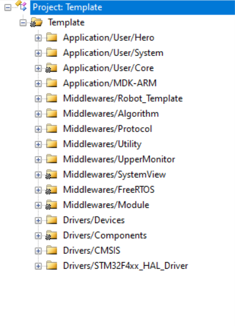
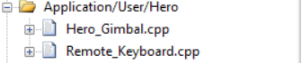
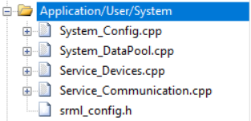
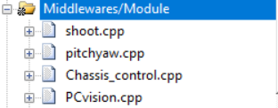
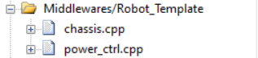
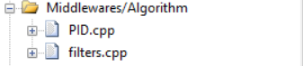
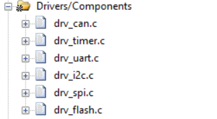
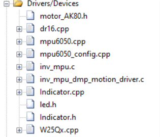
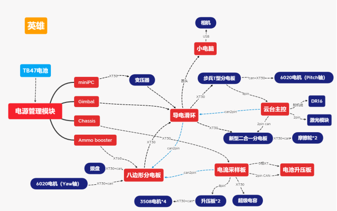
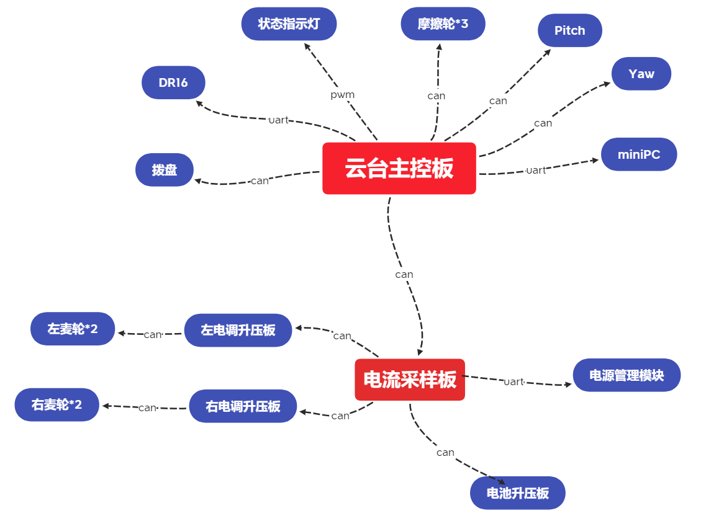

# RM 2021英雄整车代码

## 代码说明

#### Gimbal:

控制英雄云台运动机构，摩擦轮拨盘发射机构，接收处理遥控器信息，与视觉通信，解算底盘运动并下发底盘控制信息。

#### Chassis:

接收裁判系统的比赛数据，控制底盘运动，进行功率控制和电容充放电管理，UI绘制。

## 软件环境

Keil5

STM32CubeMX 

## 硬件环境

STM32F405

## 文件目录结构

工程总目录：

 

#### Application:

1. Hero文件中为云台类和键鼠控制等

 

2. System文件为各项初始化、变量存放、FreeRTOS任务、CAN和串口信息收发处理等

 

#### Middlewares:

1. Module文件为英雄发射、PitchYaw等各模块

 

2. Robot_Template中的文件为功率控制库和底盘库

 

3. Algorithm中的文件为PID和滤波器

 

#### Drivers:

1. Components文件中为SRML封装的各常用外设模块

 

2. Devices文件中为SRML封装的电机库、陀螺仪库、DR16库等

 

## 硬件系统框图：

 

## 软件数据流图：

## 未来优化向：

1. 底盘功率控制待优化，英雄运动速度较慢
2. 电容管理待优化，比赛电容掉电过快
3. 代码不够模块化，且存在耦合，后期修改时发现很难操作
